# CBInteriors Website

A full-stack CMS web application for an interior design and furniture business, built with Laravel 13 and Tailwind CSS 4.

## Screenshots

### Website Pages

| Home | About |
|------|-------|
|  | 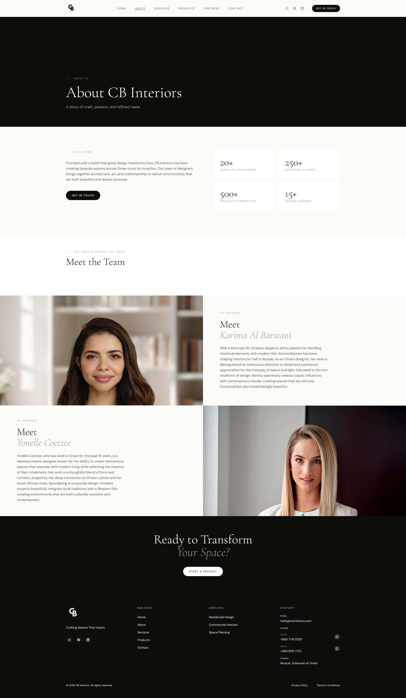 |

| Services | Products |
|----------|----------|
| 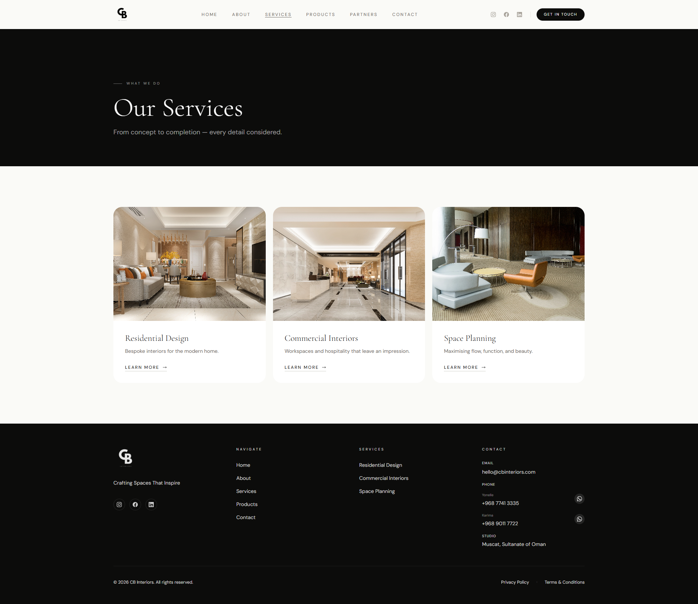 | 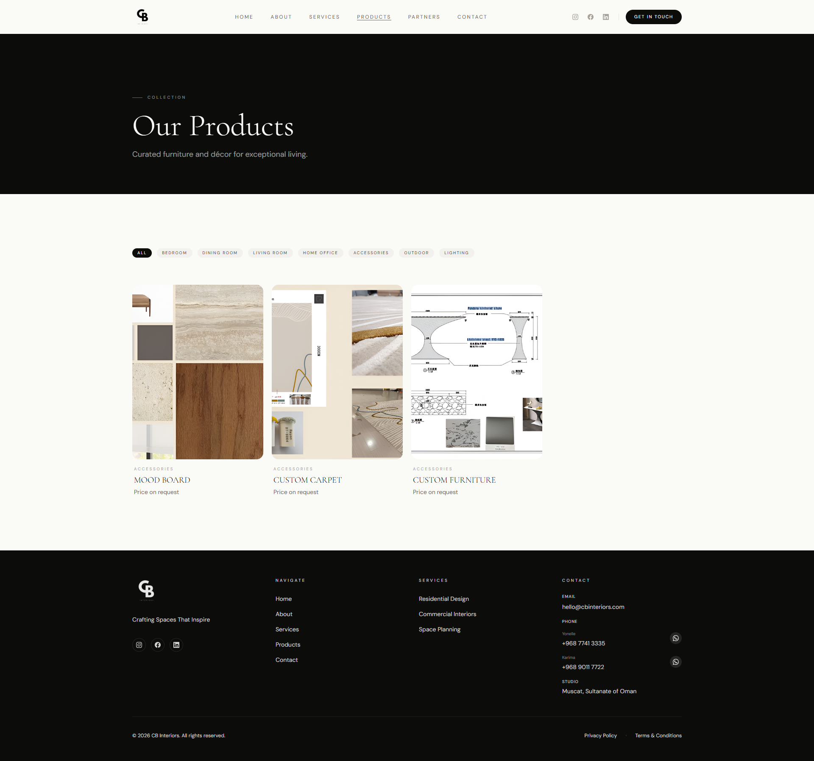 |

| Partners | Contact |
|----------|---------|
| 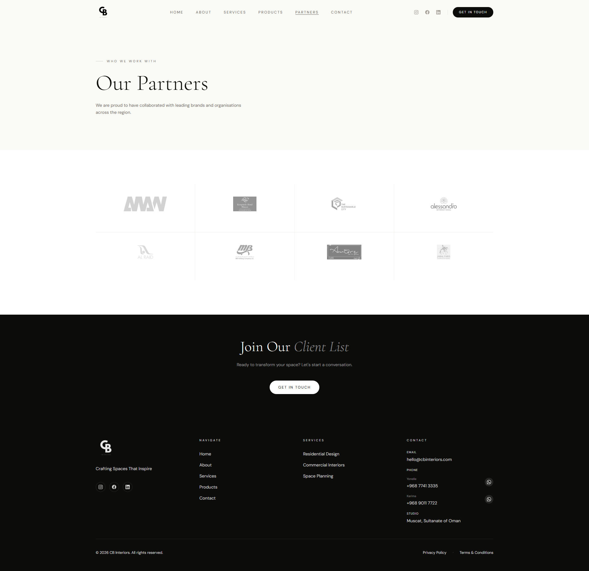 | 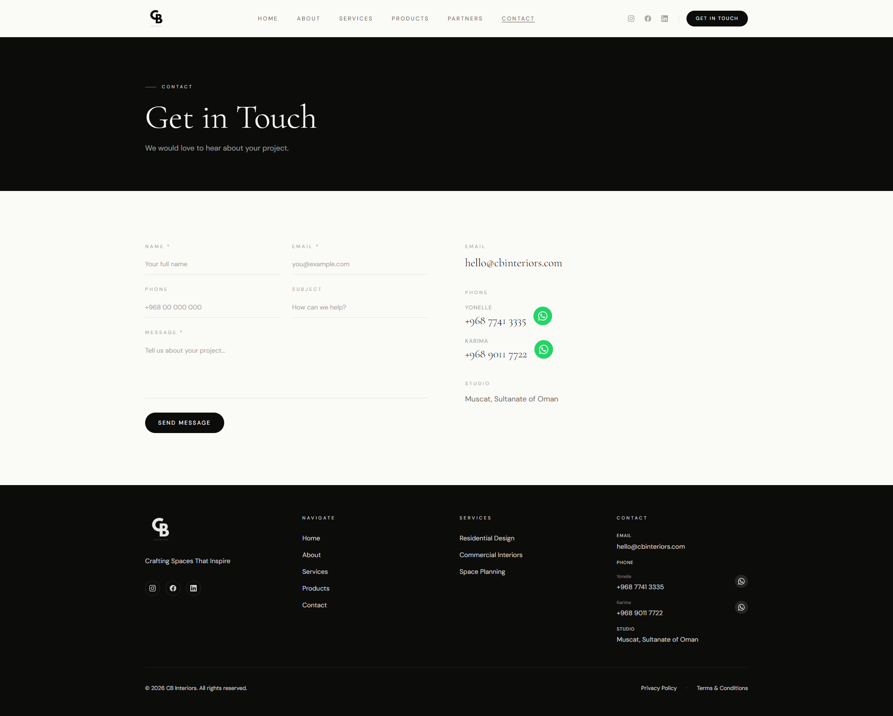 |

### Admin Dashboard

| Dashboard | Pages |
|-----------|-------|
 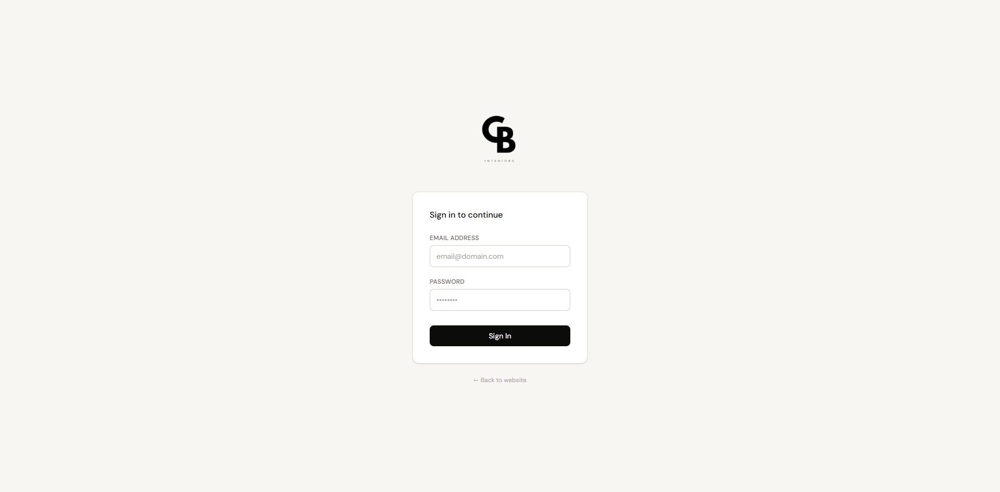 | 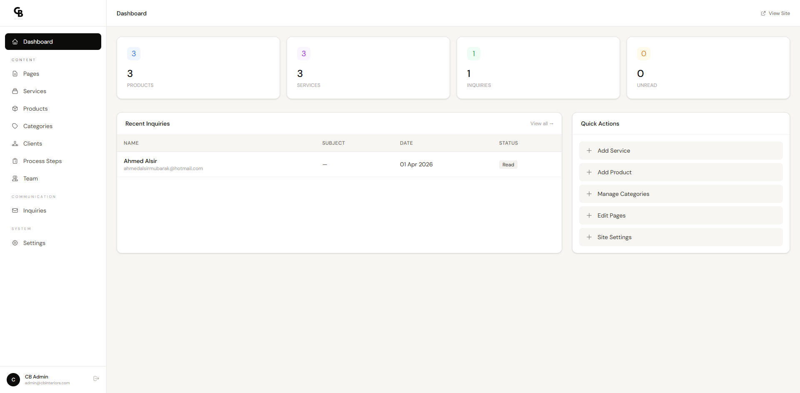 | 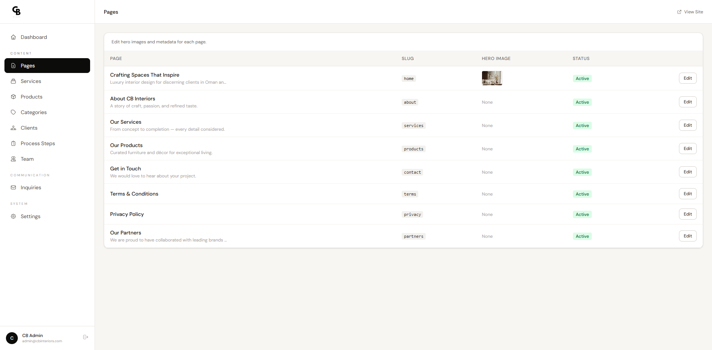 |

| Services | Products |
|----------|----------|
| 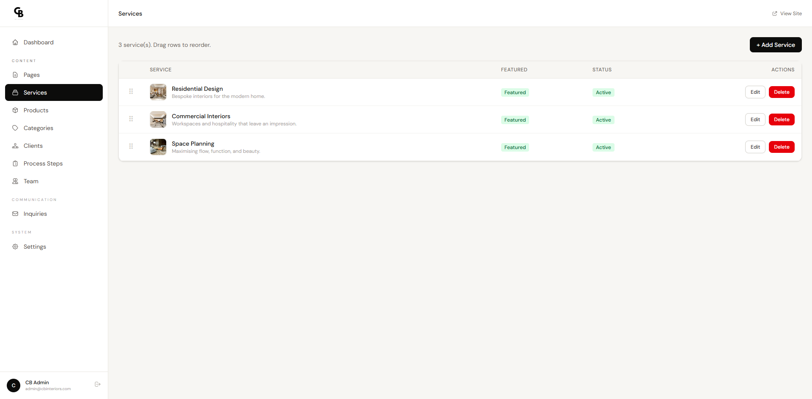 |  |

| Categories | Clients |
|-----------|---------|
| 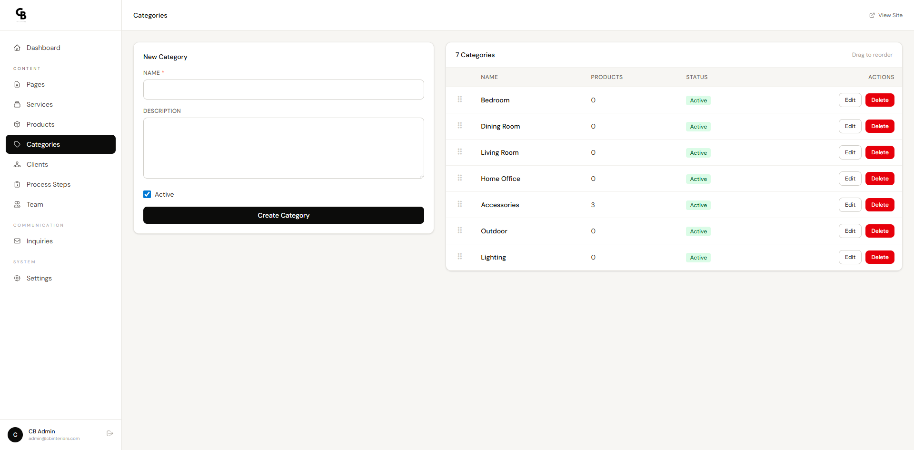 | 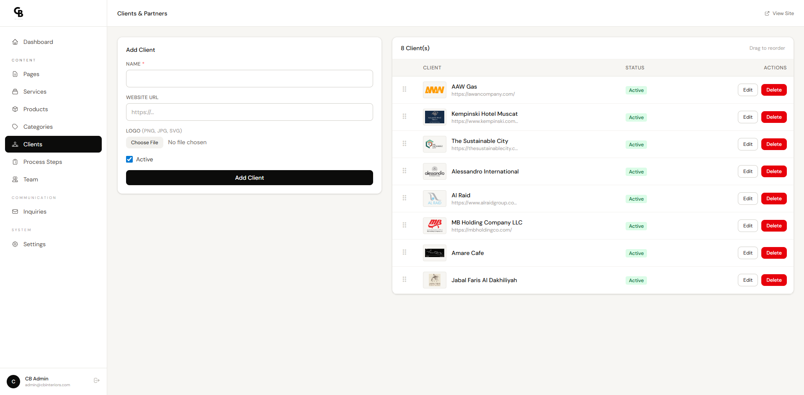 |

| Team | Inquiries |
|------|-----------|
| 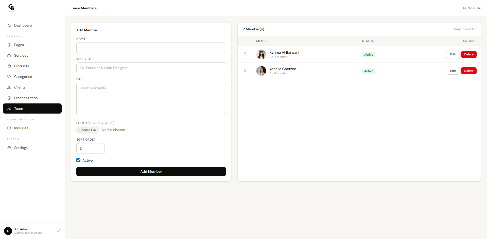 | 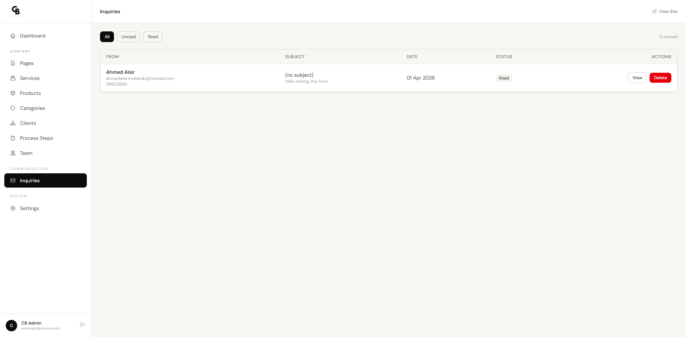 |

| Settings | Login |
|----------|-------|
| 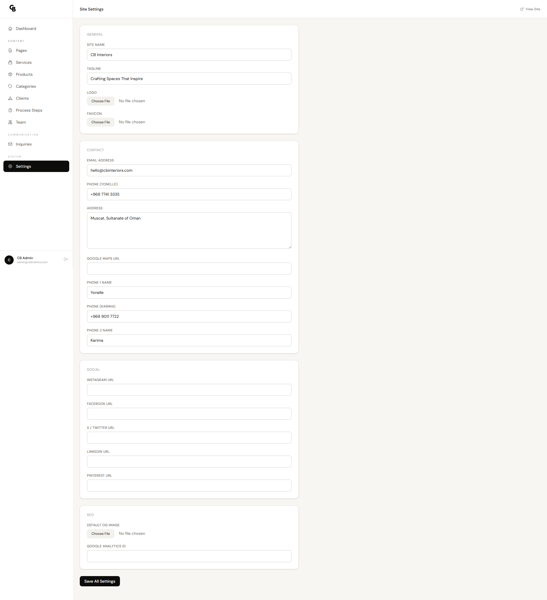 |

---

## Tech Stack

- **Backend**: PHP 8.3+, Laravel 13
- **Frontend**: Blade templates, Tailwind CSS 4, Vite
- **Database**: MySQL

## Features

### Public Website
- Home page with hero section
- About page
- Services listing with individual service pages
- Products catalog with category filtering and individual product pages
- Contact form with inquiry submissions
- Static pages (Terms, Privacy)

### Admin Dashboard
- Secure login with middleware-protected routes
- Pages management (hero image uploads)
- Services CRUD with drag-and-drop reordering
- Products CRUD with multi-image support and reordering
- Categories CRUD with reordering
- Inquiries viewer for contact form submissions
- Site-wide settings management

## Requirements

- PHP 8.3+
- Composer
- Node.js & npm
- MySQL

## Installation

1. Clone the repository:
   ```bash
   git clone <repository-url>
   cd CBinterior-website
   ```

2. Install PHP dependencies:
   ```bash
   composer install
   ```

3. Install Node.js dependencies:
   ```bash
   npm install
   ```

4. Copy the environment file and configure it:
   ```bash
   cp .env.example .env
   ```

5. Update `.env` with your database credentials:
   ```env
   DB_DATABASE=cbinterior_website
   DB_USERNAME=root
   DB_PASSWORD=
   ```

6. Generate the application key:
   ```bash
   php artisan key:generate
   ```

7. Run migrations and seeders:
   ```bash
   php artisan migrate --seed
   ```

8. Create the storage symlink:
   ```bash
   php artisan storage:link
   ```

## Development

Run all development servers concurrently (Laravel, queue, Vite):

```bash
composer run dev
```

Or run them individually:

```bash
php artisan serve       # Laravel dev server
npm run dev             # Vite asset bundler
php artisan queue:work  # Queue worker
```

## Production Build

```bash
npm run build
```

## Database Seeding

The seeders populate the database with default data:

```bash
php artisan db:seed
```

Available seeders: `UserSeeder`, `CategorySeeder`, `PageSeeder`, `ServiceSeeder`, `SettingSeeder`

## Admin Access

After seeding, log in to the admin dashboard at `/admin/login` using the credentials created by `UserSeeder`.

## Project Structure

```
app/
├── Http/
│   ├── Controllers/
│   │   ├── Admin/          # Admin panel controllers
│   │   └── ...             # Public controllers
│   └── Middleware/
│       └── AdminMiddleware.php
├── Models/                 # Eloquent models
routes/
├── web.php                 # Public routes
└── admin.php               # Admin routes
resources/
├── views/
│   ├── admin/              # Admin panel views
│   └── ...                 # Public views
database/
├── migrations/
└── seeders/
```

## License

This project is proprietary software.
